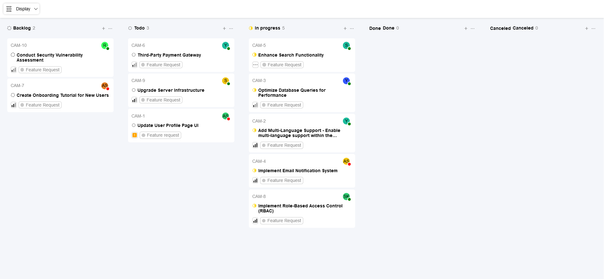

# Ticket Management Dashboard



This is a React-based project for a ticket management dashboard that allows users to view and organize tickets based on grouping and ordering criteria. The app fetches ticket and user data from an external API and displays it in a customizable interface with options to group and sort tickets by status, user, or priority.

## Table of Contents

- [Getting Started](#getting-started)
- [Features](#features)
- [Components Overview](#components-overview)
- [Folder Structure](#folder-structure)
- [Technologies Used](#technologies-used)

## Getting Started

Clone the repository, install dependencies, and start the development server.

```bash
git clone https://github.com/rudyoactiv/quicksell-assignment.git
cd quicksell-assignment 
npm install
npm start
```

## Features

- **Grouping Options**: Tickets can be grouped by status, user, or priority.
- **Ordering Options**: Tickets within each group can be ordered by priority or title.
- **Persistent Settings**: Grouping and ordering preferences are saved in `localStorage`.
- **Data Fetching**: User and ticket data are fetched from a provided API.
- **User Availability Indicator**: Shows whether a user is available or not.
- **Priority and Status Icons**: Visual representations of ticket priority and status using icons.

## Components Overview

1. **App** - The root component where grouping and ordering states are managed and passed down to children components.
2. **Navbar** - Contains the dropdown menu for selecting grouping and ordering options. Settings are passed up to the `App` component via props.
3. **Home** - Renders a series of `Column` components based on grouping criteria.
4. **Column** - Represents a column of tickets grouped by the specified criteria. Each column displays tickets sorted according to the current ordering criteria and uses icons for priority/status.
5. **Card** - Represents a single ticket card with details such as title, assigned user, and priority.

## Folder Structure

```plaintext
project-directory/
├── public/
├── src/
│   ├── assets/                 # Icons and other static assets
│   ├── components/             # Reusable UI components
│   │   ├── Navbar/             # Navbar component for grouping and ordering settings
│   │   ├── Column/             # Column component for grouping tickets
│   │   └── Card/               # Card component for each ticket
│   ├── pages/
│   │   └── Home.js             # Home page that displays columns of tickets
│   ├── App.js                  # Main application component
│   └── index.js                # Main entry point
└── package.json
```

## Technologies Used

- **React** - Frontend framework
- **CSS** - For styling components
- **JavaScript** - For interactivity and data manipulation
- **HTML** - For structuring the app
- **localStorage** - For persisting user preferences

## API Integration

The app fetches ticket and user data from an external API using the following endpoint:

```plaintext
https://api.quicksell.co/v1/internal/frontend-assignment
```

The API response includes:
- `tickets`: An array of tickets with details such as ID, title, tags, userId, status, and priority.
- `users`: An array of users with ID, name, and availability status.

## Usage

- **Grouping Dropdown**: Select "Status," "User," or "Priority" to organize the tickets accordingly.
- **Ordering Dropdown**: Select "Priority" or "Title" to change the order of tickets within each group.
- **User Availability**: A colored dot on user profiles indicates availability (green for available, red for unavailable).
- **Icons**: Status and priority icons represent the current state and importance of each ticket.
